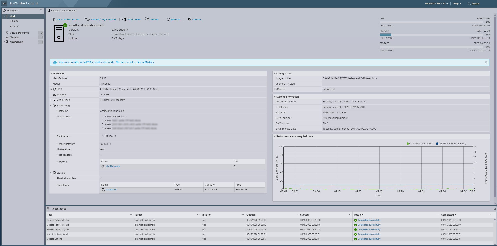

# ESXi - VMware vSphere Hypervisor 8.0U3e

Vi börjar från början. Jag går just nu en kurs om Endpoint Security och min lärare Walter gav mig förslaget att installera ESXi på mitt hemmalabb för att öka på lite erfarenhet i det området. Och det är inte alls en dålig idé. Jag kör alla mina VM-labb idag på min ordinarie stationära. Att kunna flytta över ett gäng eller starta andra labb-konstellationer utan att störa min ordinarie dator känns som en bra idé.

Så jag laddade hem senaste tillgängliga versionen, VMware vSphere Hypervisor 8.0U3e, och fixade i ordning en bootable USB så att jag kan installera.

Sedan följde jag den här guiden mer eller mindre för att komma igång: https://www.starwindsoftware.com/blog/how-to-install-vmware-esxi-and-create-your-first-vm/

Jag pluggade ur min [Ubuntu servers](https://github.com/inverterad/Homelab/tree/main/FysiskUbuntuServer) SSD och stoppade in en 1tb HDD för att testa det här. Så allt är beläget i min server. Kan bli så att jag pensionerar min Ubuntu för att ha den som en VM framöver, vi får se.

Purfärsk. Ska konfigurera lite och börja installera en VM snart.

## Ubuntu Server

Vi börjar med en Ubuntu Server-VM. Det är något jag gjort förr trots allt.

Jag installerar openssh istället för att använda ESXi:s egna konsoll, även om den verkar rätt ok så är det skönt att kunna copy-paste:a osv.

Jag ska försöka få igång Ansible och lära mig lite om det. Efter jag har lite koll så tänkte jag försöka få igång en ny VM med hjälp av Ansible, jag kommer använda Claude AI för att försöka få ordning på detta.

Vi börjar med att bara installera Ansible och försöker automatisera något, i värsta fall får jag fixa upp en till VM manuellt för konfiguration genom Ansible.

## Ansible

Jag följer [Claudes instruktioner](instruktioner/ansible.md).

Efter att jag förstått lite av Ansible genom att testa uppdatera lite på localhost så ska jag installera en till VM på ESXi:n som jag ska prova konfigurera med Ansible.

Nu har jag installerat en till VM, Kali denna gång, ett OS jag är rätt bekväm i och ett jag kan tänkas ha användning för framöver. Så ska jag försöka göra initial konfiguration med en Ansible playbook.

Det verkar som att det är en del specifik syntax för att få det här att fungera, jag följer lite Claudes instruktioner här, såhär ser en första yaml-fil ut för att uppdatera min linux-maskin med Ansible.

    # update.yaml

    - name: Playbook_Update_Kali
    hosts: webservers
    become: true

    tasks:
        - name: Uppdatera
        apt:
            update_cache: yes

        - name: Uppgradera
        apt:
            upgrade: dist

Provar köra <code>ansible-playbook -i hosts.ini update.yaml --ask-become-pass</code> och det verkar fungera!

## 2026-03-26 - Snurrar upp en ny VM genom Ansible 

<code>ansible-vault encrypt_string 'dittlösenord' --name 'esxi_pass'</code> kommer användas för att slippa ha ett lösenord lagrat i klartext.

<code>ansible-playbook site.yml --ask-vault-pass</code> när jag väl ska köra igång playbooken.

<code>sudo apt install python3-pyvmomi</code>

<code>ansible-galaxy collection install community.vmware</code>

Playbook som är Claude-genererad och konfigurerad av mig:

    name: Skapa ny VM på ESXi
    hosts: localhost
    gather_facts: false

    vars:
        esxi_host: "<ip>"
        esxi_user: "<user>"
        esxi_pass: !vault |
            $ANSIBLE_VAULT;1.1;AES256
            34<en massa siffror>35

    tasks:
        - name: Skapa VM
        community.vmware.vmware_guest:
            hostname: "{{ esxi_host }}"
            username: "{{ esxi_user }}"
            password: "{{ esxi_pass }}"
            validate_certs: false        # Sätt till true i produktion
            datacenter: "ha-datacenter"  # Standardnamn på fristående ESXi
            name: "ansible_created_vm"
            state: present
            guest_id: ubuntu64Guest
            disk:
            - size_gb: 40
                type: thin
                datastore: "datastore1"
            hardware:
            memory_mb: 2048
            num_cpus: 2
            networks:
            - name: "VM Network"
                device_type: vmxnet3
            cdrom:
            - controller_number: 0
                unit_number: 0
                state: present
                type: iso
                iso_path: "[datastore1] ISO/ubuntu-24.04.4-live-server-amd64.iso"

<code>ansible-playbook -i hosts.ini nyVM.yaml --ask-vault-pass</code>

Jag får diverse error-meddelanden, så jag får hantera detta vid ett senare tillfälle.